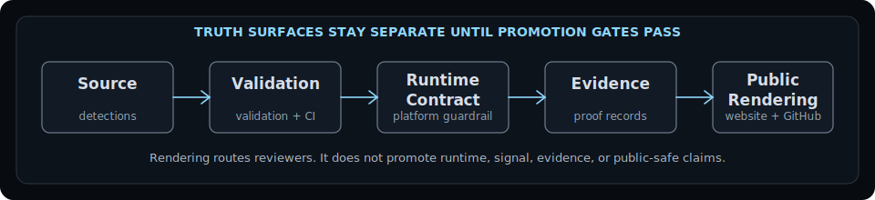

# HawkinsOperations Detection Engineering SOC

Governed detection engineering, SOC automation, and AI-assisted security operations with proof-bound claims.

**Current public proof ceiling:** `TEST_VALIDATED_SYNTHETIC_SCOPE`

HawkinsOperations speeds up security production without letting the system lie.

## What This Is

HawkinsOperations separates source, validation, runtime, signal, evidence, and public proof so security work can move faster without letting claims drift.

## Current Flagship Proof Boundary

**HO-DET-001** is the current flagship reviewer path. The public ceiling remains `TEST_VALIDATED_SYNTHETIC_SCOPE` unless a separate runtime and Splunk evidence lane proves a new ceiling through promotion gates.

| Boundary Item | Current State |
|---|---|
| HO-DET-001 source | Source exists |
| Splunk source | Source exists |
| Controlled synthetic validation | Passed within recorded synthetic scope |
| Platform runtime contract guardrail | Exists as non-promotional contract enforcement |
| Runtime, signal, and public-safe status | Blocked until evidence promotion |

## Reviewer Route

  <a href="https://hawkinsoperations.com/"><strong>hawkinsoperations.com</strong></a>
  &nbsp;|&nbsp;
  <a href="https://github.com/HawkinsOperations/hawkinsoperations-proof"><strong>proof repo</strong></a>
  &nbsp;|&nbsp;
  <a href="https://github.com/HawkinsOperations/hawkinsoperations-validation"><strong>validation repo</strong></a>
  &nbsp;|&nbsp;
  <a href="https://github.com/HawkinsOperations/hawkinsoperations-detections"><strong>detections repo</strong></a>

## System Map

`Source` → `Validation` → `Runtime Contract` → `Evidence` → `Public Rendering`

| Surface | Owns | Boundary |
|---|---|---|
| `hawkinsoperations-detections` | Detections source truth | Source exists does not prove runtime firing |
| `hawkinsoperations-validation` | Behavior and CI truth | Synthetic pass does not prove live signal |
| `hawkinsoperations-platform` | Runtime contract guardrails | Contract enforcement is not public proof |
| `hawkinsoperations-proof` | Evidence records and proof boundaries | Evidence requires review before public-safe use |
| `hawkinsoperations-website` | Public rendering and reviewer route | Website rendering is not proof |
| `.github` | Reviewer routing and governance front door | GitHub rendering is not proof |

## Real Controls

Docs, README files, issue cards, architecture maps, and diagrams are not real controls by themselves.

A control becomes real only when it blocks, fails, or forces correction through CI, branch protection, required checks, deterministic verifiers, typed claim gates, or another blocking mechanism.

## Supported Vs Blocked

| Supported | Blocked / Not Claimed |
|---|---|
| Source exists | runtime-active |
| Synthetic validation passed | signal-observed |
| Proof-bound reviewer surface | public-safe |
| CI/check-enforced validation scope | production-ready |
| Support-only AI boundary | fleet-wide |
|  | Cribl-routed |
|  | Wazuh-routed |
|  | AWS-live |
|  | autonomous SOC |
|  | AI-approved disposition |
|  | analyst-approved disposition |
|  | live Splunk fired as public proof |

## Next Gate

Next gate: controlled runtime evidence packet → sanitized case packet → deterministic verifier → proof record update.

This gate is not already complete. It must land through the separate runtime/Splunk lane before the public ceiling can change.

## Legacy Boundary

HawkinsOps / hawkinsops.com is legacy/reference unless explicitly promoted by current HawkinsOperations proof records.

Current claims live under HawkinsOperations proof boundaries.

## Doctrine

**AI is labor. Governance is authority.**

**Build loud. Verify hard. Claim tight. Ship receipts.**
