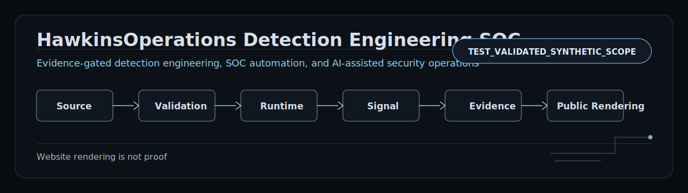
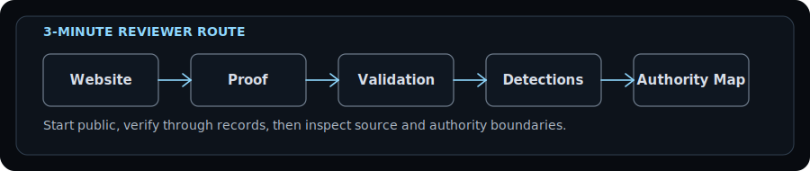
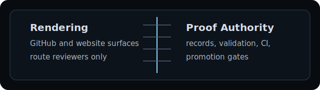

# HawkinsOperations Detection Engineering SOC

Governed detection engineering and AI-assisted SOC production.

HawkinsOperations speeds up security production without letting the system lie.

Public surfaces route reviewers to proof records and validation artifacts. Rendering is not proof.

| Surface | Current role |
|---|---|
| Current public ceiling | `TEST_VALIDATED_SYNTHETIC_SCOPE` |
| Website | Reviewer routing / public rendering only |
| Proof repo | Proof records and bounded case studies |
| Validation repo | Synthetic validation outputs |
| AI role | Support-only labor, not disposition authority |
| Authority | Deterministic checks, CI, proof records, human promotion gates |

## 3-minute reviewer route

1. Start with [hawkinsoperations.com](https://hawkinsoperations.com/) - public reviewer surface.
2. Review [hawkinsoperations-proof](https://github.com/HawkinsOperations/hawkinsoperations-proof) - proof records and case studies.
3. Review [hawkinsoperations-validation](https://github.com/HawkinsOperations/hawkinsoperations-validation) - synthetic validation outputs.
4. Review [hawkinsoperations-detections](https://github.com/HawkinsOperations/hawkinsoperations-detections) - source logic.
5. Use [START_HERE.md](./profile/START_HERE.md) / [repo authority map](./architecture/REPO_AUTHORITY_MAP.md) for deeper routing.

## System surfaces

| Plane | Repo / Surface | Owns | Does not prove by itself |
|---|---|---|---|
|  Source | [hawkinsoperations-detections](https://github.com/HawkinsOperations/hawkinsoperations-detections) | Detection source truth | Runtime firing, signal observation |
|  Validation | [hawkinsoperations-validation](https://github.com/HawkinsOperations/hawkinsoperations-validation) | Synthetic validation truth | Production/live signal |
|  Runtime | [hawkinsoperations-platform](https://github.com/HawkinsOperations/hawkinsoperations-platform) | Runtime/orchestration contracts | Public proof without evidence records |
|  Signal | Runtime and telemetry records | Observed signal context when records support it | Public proof or promotion by itself |
|  Evidence | [hawkinsoperations-proof](https://github.com/HawkinsOperations/hawkinsoperations-proof) | Proof records and case studies | Raw private runtime state |
|  Public Proof | [hawkinsoperations-website](https://github.com/HawkinsOperations/hawkinsoperations-website) | Public rendering and reviewer route | Proof authority |
|  Governance | `.github` | Governance and reviewer routing | Detection/runtime/evidence truth |

## Flagship proof boundary

HO-DET-001 is the current flagship proof path.
Its public ceiling is synthetic validation scope where records support it.
Source and validation artifacts are separated from runtime, signal, evidence, and public proof.
Stronger claims require separate evidence-backed promotion.

## Supported vs blocked claims

| Supported | Blocked / not claimed |
|---|---|
| bounded public reviewer surface | production-ready |
| separated truth surfaces | fleet-wide |
| synthetic validation public ceiling where records support it | runtime-active |
| proof-bound claim promotion model | signal-observed |
| AI support-only boundary | public-safe runtime proof |
|  | autonomous SOC |
|  | AI-approved disposition |
|  | Cribl-routed |
|  | Wazuh-routed |
|  | AWS-live |
|  | enterprise deployed |

## Claim firewall

GitHub rendering is not proof.
Website rendering is not proof.
Proof records, validation artifacts, deterministic checks, CI, and explicit promotion gates own authority.

Current public ceiling remains `TEST_VALIDATED_SYNTHETIC_SCOPE` unless explicitly promoted by proof records.

## Legacy boundary

HawkinsOps / hawkinsops.com is legacy/reference unless explicitly promoted by current HawkinsOperations proof records. Current claims live under HawkinsOperations proof boundaries.

Build loud. Verify hard. Claim tight. Ship receipts.
