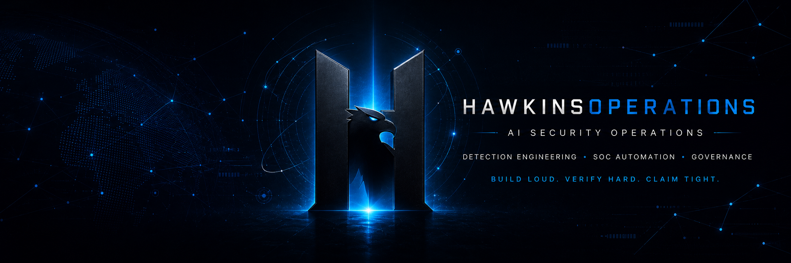

<p align="center">
  
</p>

<div align="center">

# HawkinsOperations

**A governed AI Security Operations and detection engineering system for turning AI-assisted security work into bounded, inspectable artifacts.**

AI produces labor. Evidence and human review authorize claims.

</div>

---

## Choose the right door

| If you want to... | Start here | What that surface does |
|---|---|---|
| Understand or present the complete system | **[Website / Reviewer Guide](https://hawkinsoperations.com/)** · [enter presentation mode](https://hawkinsoperations.com/?present=1&scene=1) | Visual walkthrough for a podcast, brown bag, show-and-tell, technical review, or self-guided inspection. Website rendering is not proof. |
| Explore the product | **[Hoxline](https://hawkinsoperations.com/hoxline/)** | ProofOps control for the AI security era: how AI-assisted work becomes tested, reviewed, blocked, or safe to claim. |
| Verify source and receipts | **[GitHub reviewer route](START_HERE.md)** | Source, deterministic validation, proof records, contracts, governance, and reproducible checks across seven authority repositories. GitHub rendering is not proof. |

The three surfaces work together without sharing authority: the website explains, Hoxline controls the review path, and GitHub exposes the source and receipts.

Hoxline doctrine: AI is not the authority. Evidence is.

## Fast reviewer paths

| Time | Route | Outcome |
|---:|---|---|
| **30 seconds** | [Open the Reviewer Guide](https://hawkinsoperations.com/) → [open Hoxline](https://hawkinsoperations.com/hoxline/) → [inspect HO-DET-001 proof](https://hawkinsoperations.com/proof/ho-det-001/) | Understand the system, the product control surface, and one bounded proof route. |
| **3 minutes** | Follow [source](https://github.com/HawkinsOperations/hawkinsoperations-detections/tree/main/detections/successor/ho-det-001) → [controlled validation](https://github.com/HawkinsOperations/hawkinsoperations-validation/blob/main/reports/ho-det-001/validation-result.md) → [proof record](https://github.com/HawkinsOperations/hawkinsoperations-proof/blob/main/proof/records/HO-DET-001.md) → [Claim Firewall](https://hawkinsoperations.com/claim-firewall/) | See how one detection moves through separate truth surfaces while unsupported wording stays blocked. |
| **10 minutes** | Use the [focused runnable path](START_HERE.md#10-minute-reviewer-path) | Run Hoxline's local fixture-based demo, then inspect the HO-DET-001 source, validation, proof, and claim boundary. |
| **Extended** | Use the [Reproducible Reviewer Path](../architecture/REPRODUCIBLE_REVIEWER_PATH.md) | Clone all seven repositories and run their public checks without private runtime access. |

## The system in one route

```text
AI-assisted labor
        ↓
Source-controlled security work
        ↓
Deterministic validation
        ↓
Hoxline and Claim Authority
        ↓
Evidence and proof artifacts
        ↓
Human review
        ↓
Bounded public output
```

AI may accelerate drafting, detection logic, query translation, summarization, enrichment, reviewer notes, documentation, and repetitive implementation. AI does not decide evidence sufficiency, disposition, approval, merge, claim promotion, public-safe status, production status, or case closure.

## Seven repositories, seven authority roles

| Repository | Authority role | Does not own |
|---|---|---|
| [`.github`](https://github.com/HawkinsOperations/.github) | Organization routing and governance shell | Proof, runtime, signal, or merge authority |
| [`hoxline`](https://github.com/HawkinsOperations/hoxline) | Product and ProofOps control surface | Proof records, runtime proof, or final approval |
| [`hawkinsoperations-detections`](https://github.com/HawkinsOperations/hawkinsoperations-detections) | Detection source truth | Validation, runtime, signal, or proof truth |
| [`hawkinsoperations-validation`](https://github.com/HawkinsOperations/hawkinsoperations-validation) | Controlled validation truth | Live runtime, signal, production, or disposition truth |
| [`hawkinsoperations-platform`](https://github.com/HawkinsOperations/hawkinsoperations-platform) | Contracts and control mechanics | Proof promotion or final human authority |
| [`hawkinsoperations-proof`](https://github.com/HawkinsOperations/hawkinsoperations-proof) | Evidence records and claim ceilings | Broader claims than its records support |
| [`hawkinsoperations-website`](https://github.com/HawkinsOperations/hawkinsoperations-website) | Public rendering and presentation | Source, validation, runtime, signal, or proof authority |

See the [Repository Authority Map](../architecture/REPO_AUTHORITY_MAP.md) for the complete ownership contract. No eighth system repository is created or implied here.

## One concrete receipt: HO-DET-001

HO-DET-001 is a PowerShell EncodedCommand detection example. It is useful because a reviewer can inspect each handoff separately:

1. [Detection source](https://github.com/HawkinsOperations/hawkinsoperations-detections/tree/main/detections/successor/ho-det-001) records the rule, query, metadata, and event-field expectations.
2. [Controlled validation](https://github.com/HawkinsOperations/hawkinsoperations-validation/blob/main/reports/ho-det-001/validation-result.md) checks expected matches and known non-matches with deterministic fixtures.
3. [Proof record](https://github.com/HawkinsOperations/hawkinsoperations-proof/blob/main/proof/records/HO-DET-001.md) states the supported claim and the evidence ceiling.
4. [Proof Pack 001](https://github.com/HawkinsOperations/hawkinsoperations-proof/releases/tag/hawkinsoperations-proof-pack-001) packages a bounded reviewer route with a verifier and release receipt.
5. [Website proof route](https://hawkinsoperations.com/proof/ho-det-001/) renders the reviewed boundary and routes back to its owners.

The current public ceiling for this example is `CONTROLLED_TEST_VALIDATED`. Controlled validation is evidence for the tested fixture scope; it is not automatic production truth.

## Evidence boundary

The truth surfaces may reference one another, but they are not interchangeable:

| Surface | What it can establish |
|---|---|
| Repository source | A source-controlled artifact exists. |
| Controlled validation | The checked behavior passed within the stated fixture scope. |
| Runtime | Requires runtime-owned evidence. |
| Signal | Requires observed telemetry and an authorized evidence route. |
| Proof record | Authorizes only its stated claim ceiling. |
| Public rendering | Helps a reviewer navigate; it does not create proof. |

`CONTROLLED_TEST_VALIDATED`, `NOT_PUBLIC_SAFE`, and `SCHEMA_CONTRACT_VERIFIER_EXISTS_ONLY` describe different bounded surfaces. They must not be combined into a stronger claim.

Runtime-active public proof, signal-observed public proof, production deployment, customer deployment, fleet-wide coverage, SOCaaS operation, autonomous SOC behavior, AI-approved disposition, analyst-approved disposition, public-safe runtime evidence, and case closure are not established here.

Website/GitHub rendering is not proof. Green CI is not merge authority. Human review remains mandatory.

## Deeper inspection

| Reviewer need | Owner route |
|---|---|
| Understand the full system | [Website Reviewer Guide](https://hawkinsoperations.com/) |
| Inspect ProofOps control | [Hoxline](https://github.com/HawkinsOperations/hoxline) |
| Inspect claim enforcement | [Claim Firewall](https://hawkinsoperations.com/claim-firewall/) |
| Inspect proof records and ceilings | [hawkinsoperations-proof](https://github.com/HawkinsOperations/hawkinsoperations-proof) |
| Inspect controlled validation | [hawkinsoperations-validation](https://github.com/HawkinsOperations/hawkinsoperations-validation) |
| Inspect detection source | [hawkinsoperations-detections](https://github.com/HawkinsOperations/hawkinsoperations-detections) |
| Inspect contracts and control mechanics | [hawkinsoperations-platform](https://github.com/HawkinsOperations/hawkinsoperations-platform) |
| Compare repository authority | [Repository Authority Map](../architecture/REPO_AUTHORITY_MAP.md) |
| Check current bounded wording | [Control Status Matrix](../governance/CONTROL_STATUS_MATRIX.md) |
| See controls that fired | [Governance Saves](https://hawkinsoperations.com/governance-saves/) |
| Run public checks | [Reproducible Reviewer Path](../architecture/REPRODUCIBLE_REVIEWER_PATH.md) |
| View coordination state | [Public Control Board](https://github.com/orgs/HawkinsOperations/projects/3) |

Changing counts and statuses stay in their source-owned records. This profile routes to those records instead of copying volatile metrics.

## Coordination boundary

The public Control Board is a routing snapshot. The canonical private HawkinsOperations Control Board is Project #2. Project #1 is not an active reviewer route. Project metadata remains coordination-only. Project metadata is not proof or approval. Only an authorized human can approve a merge; runtime truth, signal truth, and public-safe status remain separate.

Detailed governance and standing-control material remains available in the [Control Status Matrix](../governance/CONTROL_STATUS_MATRIX.md), [PR Review Authority](../governance/PR_REVIEW_AUTHORITY.md), and [standing control receipts](../governance/ISSUE_FACTORY_CONTROL_RECEIPTS.md).

---

## Operating doctrine

**AI is labor. Governance is authority.**

Build loud. Verify hard. Claim tight. Ship receipts.
