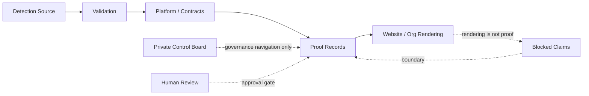

# Start Here

Start here if reviewing HawkinsOperations.

HawkinsOperations is a governed AI Security Operations and detection engineering system built around AevumGuard, source-controlled detection work, deterministic validation, platform contracts, proof records, reviewer releases, Windows/Linux runtime candidate lanes, ledger mechanics, and human-review gates.

The system separates the AevumGuard product/front-door repo, detection source, validation, platform contracts, proof records, governance routing, and public rendering so public claims cannot outrun evidence.

- AI is labor; governance is authority.
- AI can accelerate detection drafting, triage reasoning, case-packet support, documentation, and automation planning.
- AI does not decide disposition, approve claims, promote proof, or close cases.
- Validation, evidence records, proof boundaries, deterministic checks, and human review authorize operational truth.
- Green CI is evidence for the checked scope, not approval.
- Website/GitHub rendering is not proof.
- AevumGuard is the main ProofOps product/front-door repo. Claim Firewall is its first internal Claim Authority capability.

Start with the system signal, then inspect the receipts:

| Current operating signal | Value | Boundary |
|---|---:|---|
| Lifetime Governed Cases | 6 | Current strict platform ledger count; public-safe count remains 0 and closed-case count remains 0. |
| Windows Runtime Collector candidates | 1 | Private candidate lane only. |
| Linux Runtime Collector candidates | 1 | Private candidate lane only. |
| Normalized append-ready candidates | 2 | Zero duplicates; only the approved appended rows became governed cases. |
| Controlled validation activity fires | 49 | Validation activity, not governed cases or runtime signals. |
| Validation cases | 106 | Controlled/reviewer activity scale, not production coverage. |
| Proof records | 8 | Proof-record routing count, not public-safe approval. |
| Blocked claims | 31 | Claim-control count, not missing functionality. |

Windows and Linux private candidate lanes each produced one reviewed candidate. The normalizer produced two append-ready candidates with zero duplicates. After explicit approval and verifier gates, both rows were appended as governed Lifetime Ledger cases, moving the strict ledger count from 4 to 6.

## First receipts

| First check | What it shows | Boundary |
|---|---|---|
| [HO-DET-001 proof record](https://github.com/HawkinsOperations/hawkinsoperations-proof/blob/main/proof/records/HO-DET-001.md) | PowerShell EncodedCommand detection route, source, Splunk source, controlled validation, proof record, and public ceiling. | `CONTROLLED_TEST_VALIDATED`; runtime, signal, production, and public-safe claims remain blocked. |
| [Proof Pack 001 Release](https://github.com/HawkinsOperations/hawkinsoperations-proof/releases/tag/hawkinsoperations-proof-pack-001) | Bounded reviewer ZIP, SHA256, and verifier route for HO-DET-001. | Reviewer release only; not public-safe runtime proof. |
| [Reviewer metrics summary](https://github.com/HawkinsOperations/hawkinsoperations-proof/blob/main/proof/records/reviewer-metrics-pipeline-v1-summary.json) | Reviewer Metrics Pipeline v1 closeout snapshot: 49 controlled validation activity fires, 106 validation cases, 8 proof records, 31 blocked claims. | Activity metrics are not governed cases, runtime signals, or public-safe proof. |
| [Runtime Route Proof v1 reviewer map](https://github.com/HawkinsOperations/hawkinsoperations-proof/blob/main/proof/maps/RUNTIME-ROUTE-PROOF-V1-REVIEWER-MAP.md) | Private-candidate Wazuh -> Cribl -> Splunk route summary and prerelease. | `NOT_PUBLIC_SAFE`; not public runtime proof, production proof, or broad-ingestion proof. |

## Authority engines

| Engine | What it owns | Why it matters |
|---|---|---|
| Detections | Source truth | Detection logic and metadata stay source-controlled and reviewable. |
| Validation | Behavior truth | Controlled cases, case-packet checks, parity checks, AI-boundary checks, and runner trust split prove behavior inside scope. |
| Platform | Control mechanics | Contracts, schemas, factory commands, ledgers, append gates, runtime candidate lanes, and verifier guardrails make the operating model executable. |
| Proof | Claim authority | Proof records, claim ceilings, proof packs, reviewer maps, blocked claims, and releases decide what can be claimed. |
| Website | Rendering | Public cockpit and reviewer routes, not proof authority. |
| `.github` | Command center | Org front door, reviewer routing, and authority boundaries. |
| AevumGuard | Product front door | Main ProofOps product repo for the governed product experience and Claim Authority capabilities, starting with Claim Firewall. |

Platform is the mechanical control layer: contracts, factory commands, ledger mechanics, case-packet schemas, runtime candidate gates, reviewer metrics state, and verifier scripts. It does not own proof promotion or public-safe runtime truth.

Validation is the behavior engine: controlled cases, local case pipeline, registry checks, activity ledger, parity checks, blocked-claim scans, AI authority boundaries, and runner trust separation. It does not prove live runtime, signal-observed public proof, or production deployment.

Proof is the public trust anchor: proof records, claim ceilings, Proof Pack 001, Runtime Route Proof v1, reviewer maps, release routes, and proof-boundary case studies. Proof records authorize only their stated scope.

The enterprise AI failure mode is that AI-generated output becomes a public claim, analyst conclusion, operational action, security disposition, or executive truth before evidence and human review authorize it. HawkinsOperations is built to prevent that promotion path.

Current public proof is intentionally bounded. Runtime-active, signal-observed, production, SOCaaS, autonomous SOC, AI-approved disposition, analyst-approved disposition, and public-safe runtime claims remain blocked unless separately proven. Blocked claims feed AevumGuard's Claim Firewall capability; they are not failed features.

HawkinsOperations separates source, validation, runtime, signal, evidence, and public-claim truth. Each truth surface has a different owner and promotion gate.

Website content and GitHub rendering are routing only. Repository source proves source existence only.

HO-DET-001 current public repo proof level: CONTROLLED_TEST_VALIDATED.

HO-DET-001 private/internal runtime material: non-public boundary context only.

HO-DET-001 public-safe status: NOT_PUBLIC_SAFE.

HO-DET-001 has merged source, Splunk source, and controlled-test validation artifacts. The public proof record supports controlled-test validation against controlled positive and negative process-creation fixtures.

HO-DET-001 validation enforcement exists through `HawkinsOperations/hawkinsoperations-validation#10`, merge commit `8b48500d2ebbaacd93ac88e77a31dccf1d3b4e25`, only for the exact checked controlled-test validation scope and only where the workflow is required by branch protection or a ruleset.

Proof-loop CI is a real control only where branch protection or a ruleset requires it, and only for the checked controlled-test validation scope. It does not prove runtime-active, signal-observed, evidence-linked public proof, public-safe, production-ready, fleet-wide, Cribl-routed, Wazuh-routed, AWS-live, private runtime host activity, autonomous SOC, or AI-approved disposition.

Platform runtime contract enforcement exists for HO-DET-001 through `HawkinsOperations/hawkinsoperations-platform#5`, merge commit `b3d0ffbd66c1bd5f60f7e9ff99712cdc3e0595bd`. The verifier preserves `CONTROLLED_TEST_VALIDATED`, `NOT_PUBLIC_SAFE`, `BLOCKED`, `runtime_active=false`, `signal_observed=false`, and `ai_decided_disposition=false`.

This platform contract is a non-promotional guardrail. It does not prove runtime-active status, signal-observed public proof, public-safe runtime proof, live Splunk fired, Splunk-proven Runtime Signal 001, Cribl-routed status, Wazuh-routed public proof, production-ready status, fleet-wide coverage, AWS-live status, autonomous SOC operation, AI-approved disposition, or analyst-approved disposition.

HO-DET-001 has private/internal runtime boundary context through validation PR [#22](https://github.com/HawkinsOperations/hawkinsoperations-validation/pull/22), proof PR [#14](https://github.com/HawkinsOperations/hawkinsoperations-proof/pull/14), and the proof record. This is not public-safe proof and must not be represented as runtime-active deployment, signal-observed public proof, production, fleet-wide, Cribl-routed, Wazuh-routed, AWS-live, autonomous SOC, AI-approved disposition, analyst-approved disposition, or public-safe status.

HOD-001 baseline artifacts do not validate HO-DET-001. They may inform review, but they do not promote the successor detection ID.

Public claims require reviewed wording, evidence linkage, stale review, and approval.

## Reviewer Control Panel

### 30-second reviewer path

1. Open the [organization profile](./README.md) for the strongest current receipts.
2. Open the [HO-DET-001 proof record](https://github.com/HawkinsOperations/hawkinsoperations-proof/blob/main/proof/records/HO-DET-001.md) and [Proof Pack 001 Release](https://github.com/HawkinsOperations/hawkinsoperations-proof/releases/tag/hawkinsoperations-proof-pack-001) to verify the flagship proof route and bounded reviewer release.
3. Open the [Repository Authority Map](../architecture/REPO_AUTHORITY_MAP.md) to see which repo owns source, validation, platform, proof, website rendering, org routing, and the AevumGuard product/front door.
4. Open the [Platform ledger state manifest](https://github.com/HawkinsOperations/hawkinsoperations-platform/blob/main/contracts/lifetime-case-ledger-v1-state-manifest.json) and [Reviewer metrics summary](https://github.com/HawkinsOperations/hawkinsoperations-proof/blob/main/proof/records/reviewer-metrics-pipeline-v1-summary.json) to verify the two separate number systems.
5. Treat every website/GitHub page as routing unless the owning proof record supports the claim.

### 3-minute command-center path

1. Complete the 30-second reviewer path above.
2. Open the [Repository Authority Map](../architecture/REPO_AUTHORITY_MAP.md) to confirm which repo owns each truth surface.
3. Open the [Control Status Matrix](../governance/CONTROL_STATUS_MATRIX.md) to confirm the current claim ceiling and blocked claims.
4. Open the [Proof Pack 001 Release](https://github.com/HawkinsOperations/hawkinsoperations-proof/releases/tag/hawkinsoperations-proof-pack-001) and [HO-DET-001 proof record](https://github.com/HawkinsOperations/hawkinsoperations-proof/blob/main/proof/records/HO-DET-001.md) for proof-owned claim boundaries.
5. Open the [Runtime Route Proof v1 reviewer map](https://github.com/HawkinsOperations/hawkinsoperations-proof/blob/main/proof/maps/RUNTIME-ROUTE-PROOF-V1-REVIEWER-MAP.md) and [private-candidate prerelease](https://github.com/HawkinsOperations/hawkinsoperations-proof/releases/tag/runtime-route-proof-v1-private-candidate-2026-06-01) only for the private Wazuh -> Cribl -> Splunk route summary; it remains `NOT_PUBLIC_SAFE` and does not prove public-safe runtime proof, production SOC operation, autonomous SOC behavior, broad ingestion, AI-decided disposition, public publication approval, or Lifetime Governed Case mutation.
6. Open the [Standing control registers](../governance/ISSUE_FACTORY_CONTROL_RECEIPTS.md) to inspect the maintained blocked-claims register for #10 and enforcement/control-class ledger for #8. Both remain open standing controls unless Raylee approves a replacement standing-control role.
7. If you are reviewing internal operating context, open the [private org Control Board route](https://github.com/orgs/HawkinsOperations/projects/2). Treat it as work coordination only, not proof, approval, runtime state, signal state, public-safe status, or merge authority. Project #1 is not an active reviewer route.
8. Open the [Reproducible Reviewer Path](../architecture/REPRODUCIBLE_REVIEWER_PATH.md) only if you want clone-runnable inspection steps.

Current governed ledger snapshot: the platform-owned Lifetime Case Ledger state manifest records 6 ledger events, 6 total cases, 0 public-safe cases, and 0 closed cases. Ledger status remains `NOT_PUBLIC_SAFE`; front-door/status proof ceiling remains `SCHEMA_CONTRACT_VERIFIER_EXISTS_ONLY`.

Current Reviewer metrics pipeline snapshot: Detection Activity / controlled validation fire count: 49; Validation Case Count: 106; Proof Record Count: 8; Blocked Claim Count: 31; Project Board reconciliation status: `REPO_BACKED_RECONCILIATION_PLAN_NO_PROJECT_MUTATION`.

Reviewer metrics boundary: the current Lifetime Governed Cases number stays strict and comes from the platform-owned Lifetime Case Ledger route. Detection Activity / controlled validation fire count, Validation Case Count, Proof Record Count, and Blocked Claim Count are separate reviewer activity metrics and must not be counted as governed cases. Project Board reconciliation is repo-backed routing/status only; Project metadata is not proof authority and no GitHub Project mutation is performed by this pipeline.

Runtime Route Proof v1 private-candidate boundary: the proof repo routes a reviewer map and prerelease for one private controlled Wazuh -> Cribl -> Splunk marker summary. Claim ceiling remains `PRIVATE_RUNTIME_ROUTE_PROOF_V1_CANDIDATE_PRESERVED`; public-safe status remains `NOT_PUBLIC_SAFE`; it does not mutate the Lifetime Governed Case ledger; `AI_DECIDED_DISPOSITION=false`.

### 10-minute reviewer path

1. Complete the 3-minute command-center path above.
2. Run the [Reproducible Reviewer Path](../architecture/REPRODUCIBLE_REVIEWER_PATH.md) for clone-runnable source, validation, and proof inspection.
3. Run `python scripts/verify-command-center-invariants.py` from the `.github` repo to check command-center route and claim-boundary invariants.
4. Treat verifier success as validation truth only for the checked invariant scope. It does not prove runtime, signal, public-safe, production, Project-board approval, or merge authority.

### What to click first

| Question | Click |
|---|---|
| What is HawkinsOperations? | [Organization profile](./README.md) |
| Which repo owns which truth? | [Repository Authority Map](../architecture/REPO_AUTHORITY_MAP.md) |
| What is proven and what is blocked? | [Control Status Matrix](../governance/CONTROL_STATUS_MATRIX.md) |
| Where are the standing control ledgers? | [Standing control registers](../governance/ISSUE_FACTORY_CONTROL_RECEIPTS.md) |
| Where are proof records? | [hawkinsoperations-proof](https://github.com/HawkinsOperations/hawkinsoperations-proof) |
| Where is the main product/front-door repo? | [aevumguard](https://github.com/HawkinsOperations/aevumguard) |
| Where is the Runtime Route Proof v1 private-candidate route? | [Reviewer map](https://github.com/HawkinsOperations/hawkinsoperations-proof/blob/main/proof/maps/RUNTIME-ROUTE-PROOF-V1-REVIEWER-MAP.md) and [prerelease](https://github.com/HawkinsOperations/hawkinsoperations-proof/releases/tag/runtime-route-proof-v1-private-candidate-2026-06-01) |
| Where are validators and case packets? | [hawkinsoperations-validation](https://github.com/HawkinsOperations/hawkinsoperations-validation) |
| Where is detection source? | [hawkinsoperations-detections](https://github.com/HawkinsOperations/hawkinsoperations-detections) |
| Where is public rendering? | [hawkinsoperations-website](https://github.com/HawkinsOperations/hawkinsoperations-website) |
| Where is the operating cockpit? | [private org Control Board route](https://github.com/orgs/HawkinsOperations/projects/2) |
| Where is the current governed ledger state? | [Platform ledger state manifest](https://github.com/HawkinsOperations/hawkinsoperations-platform/blob/main/contracts/lifetime-case-ledger-v1-state-manifest.json) |
| Where is the reviewer metrics summary? | [Reviewer metrics proof summary](https://github.com/HawkinsOperations/hawkinsoperations-proof/blob/main/proof/records/reviewer-metrics-pipeline-v1-summary.json) |

### What each repo owns

| Repo | Owns | Does not own |
|---|---|---|
| `.github` | Command-center routing and governance shell. | Proof, runtime state, signal state, or public-safe approval. |
| `hawkinsoperations-detections` | Detection source truth. | Validation, runtime, signal, or public proof. |
| `hawkinsoperations-validation` | Behavior truth, fixtures, case packets, parity checks, and deterministic checks. | Runtime deployment or public-safe proof. |
| `hawkinsoperations-platform` | Control mechanics, contracts, ledgers, append gates, runtime candidate lanes, and guardrail logic. | Public proof or production readiness. |
| `hawkinsoperations-proof` | Claim authority, proof records, evidence boundaries, and claim ceilings. | Raw private evidence publication or claim expansion by presentation. |
| `hawkinsoperations-website` | Public rendering and reviewer cockpit. | Proof authority. |
| `aevumguard` | Product/front-door repo for AevumGuard, the ProofOps product. Claim Firewall is the first internal Claim Authority capability inside AevumGuard. | Proof authority, runtime state, signal state, public-safe approval, or an eighth-repo expansion path. |

Total HawkinsOperations system repos remain seven: `.github`, `hawkinsoperations-detections`, `hawkinsoperations-validation`, `hawkinsoperations-platform`, `hawkinsoperations-proof`, `hawkinsoperations-website`, and `aevumguard`. No eighth repo may be added without explicit approval.

### What is proven vs blocked

| Status | Current reviewer-safe wording |
|---|---|
| Proven within current public ceiling | HO-DET-001 source exists and controlled-test validation is recorded for the stated fixture scope. |
| Route-safe | GitHub and website surfaces route reviewers to source, validation, and proof records. |
| Ledger route-safe | The platform-owned Lifetime Case Ledger state manifest routes bounded current counts only: 6 events, 6 cases, 0 public-safe cases, 0 closed cases. |
| Reviewer metrics route-safe | The reviewer metrics pipeline routes separate bounded numbers for Lifetime Governed Cases, Detection Activity / controlled validation fire count, Validation Case Count, Proof Record Count, Blocked Claim Count, and Project Board reconciliation status. |
| Runtime route private-candidate route-safe | Runtime Route Proof v1 routes one private controlled Wazuh -> Cribl -> Splunk marker summary to proof records and a prerelease; it remains `NOT_PUBLIC_SAFE` and does not promote public-safe runtime proof, production SOC operation, autonomous SOC behavior, broad ingestion, AI-decided disposition, public publication approval, or Lifetime Governed Case mutation. |
| Blocked | Runtime-active, signal-observed, public-safe runtime proof, production-ready, autonomous SOC, AI-approved disposition, analyst-approved disposition, Cribl-routed, Wazuh-routed, AWS-live, fleet-wide, and live Splunk firing claims. |

### What not to infer

Do not infer runtime operation, signal observation, production readiness, fleet scope, public-safe approval, analyst disposition, AI disposition, or public proof from GitHub rendering, website rendering, issue status, private Control Board membership, branch names, diagrams, or docs alone.

The private Control Board exists for internal governance and navigation. It is not proof and is not public.

## Reviewer Links

- [Organization profile](./README.md)
- [Organization system map](../wiki/11_ORG_SYSTEM_MAP.md)
- [Cross-repo promotion map](../governance/CROSS_REPO_PROMOTION_MAP.md)
- [Governance summary](../governance/GOVERNANCE_SUMMARY.md)
- [PR review authority](../governance/PR_REVIEW_AUTHORITY.md) - merge governance routing; not runtime, signal, evidence, public-safe, or production proof unless backed by rulesets or blocking CI
- [Repository authority map](../architecture/REPO_AUTHORITY_MAP.md)
- [Control status matrix](../governance/CONTROL_STATUS_MATRIX.md)
- [Standing control registers](../governance/ISSUE_FACTORY_CONTROL_RECEIPTS.md) - blocked-claims register for #10 and enforcement/control-class ledger for #8; remain open standing controls unless Raylee approves a replacement standing-control role; report-only unless backed by fail-closed controls
- [Command-center invariants](../governance/COMMAND_CENTER_INVARIANTS.json) and verifier - route and claim-boundary invariant check; validation truth only for checked scope
- [Proof Pack 001 official GitHub Release](https://github.com/HawkinsOperations/hawkinsoperations-proof/releases/tag/hawkinsoperations-proof-pack-001) - bounded reviewer ZIP route for HO-DET-001; ZIP SHA256 `44d8a643aa2b113c9e99be0462e699d39af707a67190823cc05bb381907dc452`; public-safe runtime proof remains BLOCKED
- [Runtime Route Proof v1 reviewer map](https://github.com/HawkinsOperations/hawkinsoperations-proof/blob/main/proof/maps/RUNTIME-ROUTE-PROOF-V1-REVIEWER-MAP.md) and [private-candidate prerelease](https://github.com/HawkinsOperations/hawkinsoperations-proof/releases/tag/runtime-route-proof-v1-private-candidate-2026-06-01) - private Wazuh -> Cribl -> Splunk route summary only; public-safe runtime proof, production SOC operation, autonomous SOC behavior, broad ingestion, AI-decided disposition, public publication approval, and Lifetime Governed Case mutation remain blocked
- [Proof Pack 001 Discussion](https://github.com/orgs/HawkinsOperations/discussions/32) - official announcement route; rendering is not proof
- [Private org Control Board route](https://github.com/orgs/HawkinsOperations/projects/2) - operating cockpit for current work visibility; Project #1 is not an active reviewer route; not proof authority, merge authority, or project metadata approval
- [Platform ledger state manifest](https://github.com/HawkinsOperations/hawkinsoperations-platform/blob/main/contracts/lifetime-case-ledger-v1-state-manifest.json) - current bounded governed ledger count summary; ledger status remains `NOT_PUBLIC_SAFE`
- [Reviewer metrics proof summary](https://github.com/HawkinsOperations/hawkinsoperations-proof/blob/main/proof/records/reviewer-metrics-pipeline-v1-summary.json) - bounded reviewer metrics route; keeps strict governed cases separate from broader activity counts and Project Board reconciliation status
- [HO-DET-001 proof record](https://github.com/HawkinsOperations/hawkinsoperations-proof/blob/main/proof/records/HO-DET-001.md)
- [HO-DET-001 runtime packet verifier PR #22](https://github.com/HawkinsOperations/hawkinsoperations-validation/pull/22)
- [HO-DET-001 verified runtime match proof PR #14](https://github.com/HawkinsOperations/hawkinsoperations-proof/pull/14)
- [HO-DET-001 platform runtime contract](https://github.com/HawkinsOperations/hawkinsoperations-platform/blob/main/contracts/examples/ho-det-001-runtime-contract.sample.json)
- [hawkinsoperations.com](https://hawkinsoperations.com) - current public rendering route, not proof
- [rayleeops.com](https://rayleeops.com) - public operating journal / external context, not HawkinsOperations proof
- [hawkinsops.com](https://hawkinsops.com) - legacy/reference route, not current proof authority

## Review Boundary

Allowed current wording:

- "HO-DET-001 source exists."
- "HO-DET-001 Splunk source exists."
- "HO-DET-001 passed controlled-test validation against controlled positive and negative process-creation fixtures."
- "HO-DET-001 validation enforcement exists for the exact checked controlled-test validation scope."
- "HO-DET-001 platform runtime contract enforcement exists as a non-promotional guardrail."
- "HO-DET-001 current public repo proof level is CONTROLLED_TEST_VALIDATED."
- "HO-DET-001 private/internal runtime material is non-public boundary context."
- "HO-DET-001 public-safe status is NOT_PUBLIC_SAFE."
- "HOD-001 baseline artifacts are separate reference material."

Blocked current wording:

- "HO-DET-001 is production-ready."
- "HO-DET-001 is fleet-wide."
- "HO-DET-001 is enterprise deployed."
- "HO-DET-001 is Cribl-routed."
- "HO-DET-001 is Wazuh-routed."
- "HO-DET-001 is public-safe."
- "HO-DET-001 public proof is complete."
- "Live Splunk fired as public proof."
- "HO-DET-001 is runtime-active" unless explicitly scoped to private controlled lab evidence.
- "HO-DET-001 has signal-observed status" unless explicitly scoped to private controlled lab signal observed.
- "HO-DET-001 is evidence-linked public proof."
- "HO-DET-001 has public-safe runtime proof."
- "HO-DET-001 has signal-observed public proof."
- "HO-DET-001 is AWS-live."
- "HO-DET-001 operates as autonomous SOC."
- "HO-DET-001 has AI-approved disposition."
- "HO-DET-001 has analyst-approved disposition."
- Any wording that exposes raw command lines, encoded payloads, LAN IPs, local artifact paths, raw CSV names, or screenshots as public evidence.
